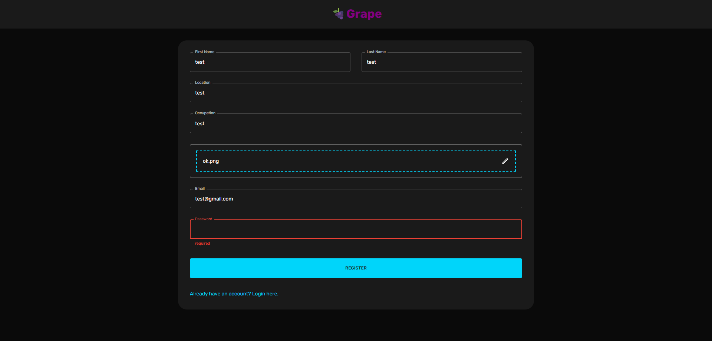
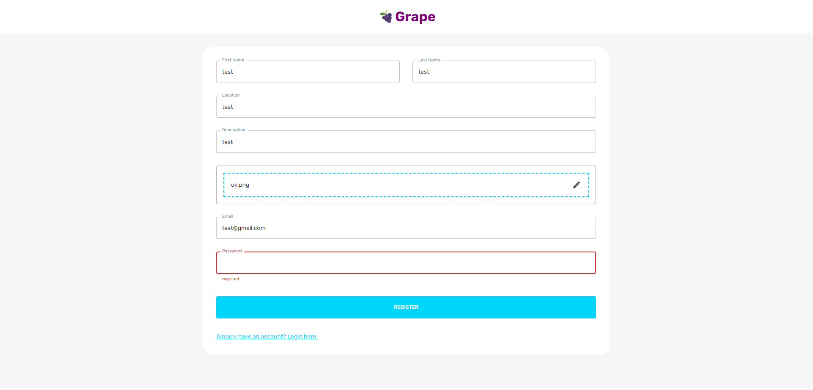
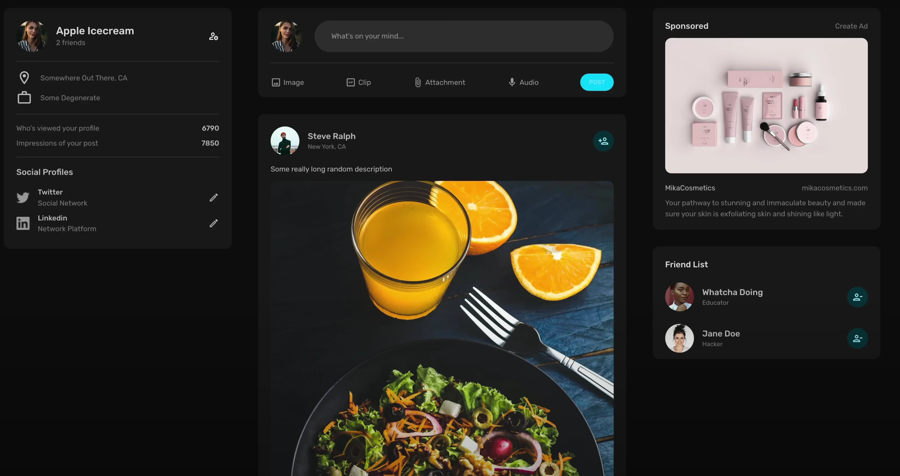
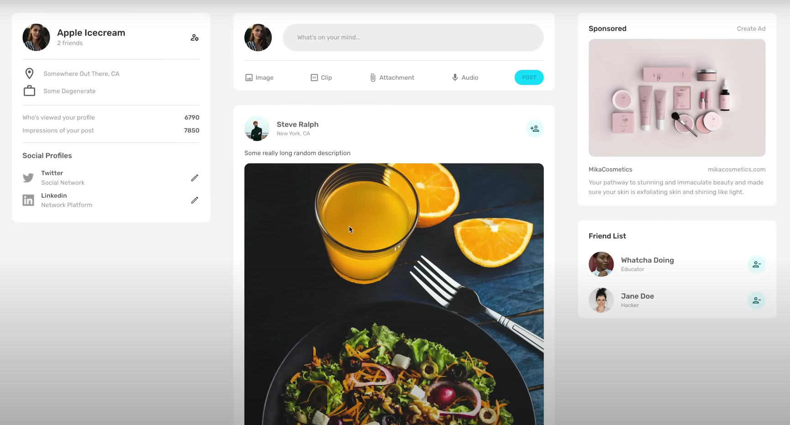

# Grape - Dynamic Social Media Site

Grape is a dynamic social media site developed using the MERN stack (MongoDB, Express.js, React, Node.js). It provides users with a platform to connect, share, and interact in a seamless and engaging environment. Grape comes equipped with a range of features, from secure user authentication and data protection to visually appealing and responsive user interfaces, thanks to the integration of Material-UI (MUI).

## Features

- **User Authentication**: Grape ensures the security of user data through the implementation of JSON Web Tokens (JWT) and bcrypt. This guarantees that user information remains protected and confidential.

- **State Management**: Redux is employed to manage the application's state efficiently. This aids in maintaining a consistent user experience and enhances the overall performance of the site.

- **File Uploads**: With the utilization of Multer, Grape allows users to upload files, fostering a dynamic and interactive content-sharing experience.

- **Visually Appealing Design**: Grape stands out with its visually appealing and user-friendly design, made possible by the integration of Material-UI (MUI). This ensures that users have an engaging and pleasant interaction with the platform.

## Technologies Used

- **Frontend**: React.js, Material-UI (MUI), Redux
- **Backend**: Node.js, Express.js
- **Database**: MongoDB
- **Authentication**: JSON Web Tokens (JWT), bcrypt
- **File Uploads**: Multer

## Getting Started

Follow these steps to get Grape up and running on your local machine:

1. Clone the repository: `git clone git@github.com:devanshu-gupta2002/grape.git`
2. Navigate to the project directory: `cd grape`
3. Install frontend dependencies: `cd client && npm install`
4. Install backend dependencies: `cd ../server && npm install`
5. Configure environment variables:
   - Create a `.env` file in the `server` directory.
   - Add your MongoDB connection URI as `MONGO_URI=<your-mongodb-uri>`
   - Set your JWT secret key as `JWT_SECRET=<your-jwt-secret>`
6. Run the frontend: In the `client` directory, run `npm start`
7. Run the backend: In the `server` directory, run `npm start`

Grape should now be accessible at `http://localhost:3000`.

## Contributing

We welcome contributions to Grape! To contribute, please follow these steps:

1. Fork the repository
2. Create a new branch: `git checkout -b feature/your-feature-name`
3. Commit your changes: `git commit -m "Add your message here"`
4. Push to the branch: `git push origin feature/your-feature-name`
5. Create a pull request

## Contact

For any inquiries or feedback, please contact me at devanshuguptaknp@gmail.com.

## Gallery

---

Give Grape a try and start connecting with others in a dynamic and visually appealing social media environment. Happy sharing and interacting!